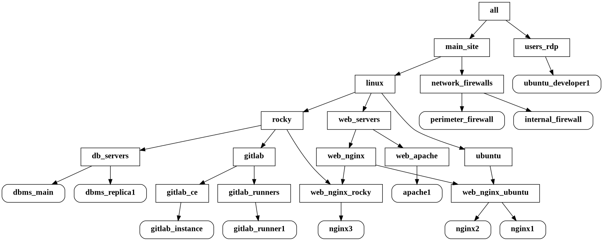
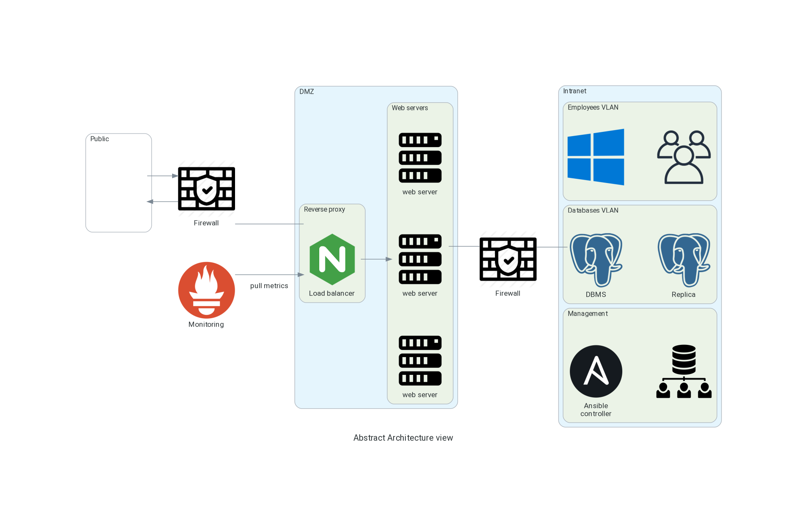

In this repository you will find configurations and playbooks used to automate the continuos deployment of infrastructure

**Features and concepts** include writing Ansible roles and tasks, Jinja Templating,referencing automations from ansible galaxy, utilizing variables for use cases like installing a package with different names on different Linux distributions, or using variables to modify configurations easily

**For example check** [main file](site.yml) or [nginx role](roles/web_nginx/) or [linux firewalls role](roles/linux_firewalls/)


To run playbooks:
1. edit the `production_inventory.yml` or `staging_inventory.ini` or add your own inventory with your own hosts
2. refactor the playbooks as you want
3. run commands like:
``` bash
ansible-playbook --tags ubuntu --ask-become-pass deployment.yml
```

or 
``` bash
ansible-playbook site.yml -i production_inventory.yml --limit web_nginx
```

**To Do**:
- [x] Split into roles to make it modular (See my [roles tiny script](https://github.com/jupiter-commits/Tiny-scripts/blob/36bec2a1913a5b3a07ddb8fe9f63e0f2578dac68/roles.sh) )
- [x] Complete missing plays for different machines

**Dependencies**
- Install the GitLab collection referenced form ansible galaxy `ansible-galaxy collection install srv6d.gitlab` to run the GitLab role


**Inventory graph:**


**architecture view:**

